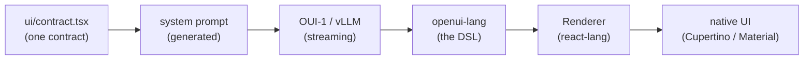

<h1 align="center">AppLess &middot; a phone with no apps. just ask.</h1>

<p align="center">
  Every screen is generated the moment you ask, streamed live, and rendered in
  real native UI: Cupertino on iOS, Material 3 on Android.
</p>

<p align="center">
  <a href="https://openui.com">openui.com</a> &nbsp;&middot;&nbsp;
  <a href="#demo">Demo</a> &nbsp;&middot;&nbsp;
  <a href="#quick-start">Quick start</a> &nbsp;&middot;&nbsp;
  <a href="#how-it-works">How it works</a>
</p>

<p align="center">
  
  
  
</p>

---

## Demo

<p align="center">
  
</p>

There are no apps to install, no menus to learn, no home screen full of icons.
You open AppLess and ask for what you want, and the screen for it is generated
on the spot: a weather dashboard, a restaurant list with live search, a booking
form, a chat thread. Tap anything and the next screen is generated too, already
prefetched so it appears instantly.

It is a demo of what a **generative UI operating system** feels like, built
entirely on [OpenUI](https://openui.com), the open standard for LLM-generated
interfaces. The model does not return JSON or hand-written screens; it writes
**openui-lang**, a compact streaming-first UI language that the OpenUI renderer
turns into live, interactive native components.

> [!WARNING]
> **AppLess is an experiment** by the creators of [OpenUI](https://openui.com) to
> push the boundaries of Generative UI, with no real integrations behind it. Screen
> _content_ is generated by the model: turn on the optional web and image tools and
> it can be grounded in real data (real places, prices, news, photos); without them
> it is plausible fiction. The _actions_ are always simulated, though. "Order
> placed", "flight booked", "payment sent", and live health stats do nothing and
> reflect no real state, because nothing is wired up yet. It is a glimpse of what a
> generative-UI OS could feel like, not a working replacement for your apps, at
> least until someone [makes it real](#fork-it-and-make-it-yours).

## Quick start

```bash
git clone https://github.com/thesysdev/appless.git
cd appless
npm install            # postinstall applies the react-lang patch
npm run ios            # or: npm run android, or npm start for Expo Go
```

Screens are generated by [OUI-1](https://huggingface.co/thesysdev/OUI-1), served
with **vLLM 0.24 or newer** on a GPU host. The phone connects directly to that
server; the model does not run inside the Expo app. On the GPU host:

```bash
pip install "vllm>=0.24"
bash scripts/serve-oui.sh
```

The script serves the merged checkpoint as `OUI-1`, with FP8 weights, a
16,384-token context, four concurrent sequences, and the `gemma4` tool-call
parser. It uses the checkpoint's diffusion sampler settings. Follow the
[model card](https://huggingface.co/thesysdev/OUI-1#vllm-recommended) for hardware
requirements (FP8 weights occupy about 25.8 GiB, plus runtime/cache memory).
Override `VLLM_HOST`, `VLLM_PORT`, `VLLM_MAX_MODEL_LEN`, or `VLLM_MAX_NUM_SEQS` as
needed; additional arguments are forwarded to `vllm serve`.

Copy `.env.example` to `.env.local` and set the address reachable from your app:

```bash
EXPO_PUBLIC_MODEL_BASE_URL=http://192.168.1.100:8000/v1
EXPO_PUBLIC_APPLESS_MODEL=OUI-1
EXPO_PUBLIC_APPLESS_MAX_TOKENS=4096
EXPO_PUBLIC_APPLESS_PREFETCH_LIMIT=1
# EXPO_PUBLIC_EXA_API_KEY=             # enable web_search (Exa)
# EXPO_PUBLIC_UNSPLASH_ACCESS_KEY=     # semantic photos (else LoremFlickr)
```

Replace the example IP with your GPU host's LAN address, or use its HTTPS URL.
The built-in defaults target `localhost:8000/v1` on iOS simulator/web and
`10.0.2.2:8000/v1` on the Android emulator; these work when the server is on the
development host. On a real phone, `localhost` is the phone itself. For a
standalone native build, prefer an HTTPS endpoint; cleartext HTTP/local-network
access may require platform-specific build permissions. Web builds also need
the server to allow their origin. Restart Expo after changing environment values.

Local servers without authentication open immediately. For a protected endpoint,
start vLLM with `bash scripts/serve-oui.sh --api-key your-server-key` and set
`EXPO_PUBLIC_MODEL_AUTH_REQUIRED=1` to prompt for that key in the app. A server
401/403 also opens the key prompt. Entered keys are stored per endpoint in
Keychain/Keystore (localStorage on web); old Cerebras credentials are not reused.
For development, `EXPO_PUBLIC_MODEL_API_KEY` skips entry, but all `EXPO_PUBLIC_*`
values are included in the app bundle. Remote deployments should put vLLM behind
authenticated HTTPS access; see [vLLM security](https://docs.vllm.ai/en/latest/usage/security/).

OUI-1 streams committed 256-token blocks. It ignores request temperature and seed,
so the client sends neither. The original prefetch logic generates likely next
screens ahead of a tap. `EXPO_PUBLIC_APPLESS_PREFETCH_LIMIT` controls how many
destinations to generate per screen: `1` by default, `0` to disable, up to `6`.
This is optional and trades extra model requests for faster navigation.
If the server rejects the context length, the app retries after dropping the
oldest complete ancestor exchange, preserving the current request and tool
results. If those alone exceed the limit, it reports an actionable error.

> Expo SDK 54 is pinned to match the Expo Go build on the App Store and Play
> Store. If your Expo Go reports a different SDK, run
> `npx expo install expo@^<version> && npx expo install --fix`.

## How it works



One contract, `ui/contract.tsx`, is the single source of truth for every
component the model can use: its name, its props, and a description. That
contract generates the system prompt, so the model always knows exactly the UI
vocabulary the app can render. As tokens stream back, the OpenUI
[`<Renderer>`](https://openui.com) parses openui-lang incrementally and paints
real native components, live, before the response has even finished.

Two design systems implement that one contract, so the same generated screen
renders as **Cupertino** on iOS and **Material 3** on Android with no change to
the prompt. Tapping a row, chip, or button streams the next screen; the app
speculatively prefetches likely destinations so navigation feels instant.

**Real tools, in the app.** When a screen needs live facts (news, prices, real
places), the model calls a `web_search` tool ([Exa](https://exa.ai)) mid-stream
and composes the screen from the results, sources cited. Images are referenced
as semantic queries the app resolves on-device.

## Packages

AppLess is a thin, native shell over the OpenUI runtime. The heavy lifting is
the OpenUI stack:

| Package | Role |
| --- | --- |
| [`@openuidev/react-lang`](https://openui.com) | The OpenUI runtime: parses streaming openui-lang and renders it through a pluggable component library. The core of the whole app. |
| [`@openuidev/cli`](https://openui.com) | Generates the system prompt from the component contract (`npm run generate:prompt`). |
| [`expo`](https://expo.dev) / [`react-native`](https://reactnative.dev) | The native app runtime (Expo SDK 54, New Architecture). |
| [`react-native-svg`](https://github.com/software-mansion/react-native-svg) | Chart geometry shared across both design systems. |
| [`react-native-webview`](https://github.com/react-native-webview/react-native-webview) | Keyless Google Maps embed for `MapView`. |
| [`expo-linear-gradient`](https://docs.expo.dev/versions/latest/sdk/linear-gradient/) | Card and hero gradients. |
| [`lucide-react-native`](https://lucide.dev) / [`phosphor-react-native`](https://phosphoricons.com) | Icon sets for generated rows and the home shell. |
| [`expo-secure-store`](https://docs.expo.dev/versions/latest/sdk/securestore/) | On-device storage for the user's API key (Keychain / Keystore). |
| [`zod`](https://zod.dev) | Prop schemas in the component contract. |
| [`@react-native-community/slider`](https://github.com/callstack/react-native-slider) | Native slider input for forms. |

Screens are generated by [OUI-1](https://huggingface.co/thesysdev/OUI-1) on your
vLLM server; optional live search is powered by [Exa](https://exa.ai) with your
own Exa key.

## Design systems

The model-facing contract and the design languages are deliberately separate so
platforms can look native without ever drifting the prompt:

- [`ui/contract.tsx`](src/appless/ui/contract.tsx) - component names, prop schemas,
  and descriptions. The single source that generates the system prompt.
- [`ui/cupertino/`](src/appless/ui/cupertino) - iOS renderers: inset grouped
  lists, icon badges, segmented tabs, iOS switch.
- [`ui/material/`](src/appless/ui/material) - Android renderers: Material 3 tonal
  surfaces, ripple, filter chips, underline tabs, native switch.
- [`ui/shared/`](src/appless/ui/shared) - chart, map, form, and image logic shared
  by every design system.

## Tests

```bash
npm test    # renders exemplar generated screens through the full
            # parser -> Renderer -> native component pipeline (jest-expo,
            # headless), for both Cupertino and Material renderer sets
```

For a live check, start vLLM and the app, open a screen, tap a detail row, submit
a form, and (with an Exa key) request current weather. Confirm that the tool
result becomes the next screen. Set the prefetch limit to `0` to check generation
only when the user requests a screen.

## Fork it and make it yours

The actions and state are simulated only because nothing is wired to a real
service yet, and that missing piece is usually just one integration. We would
love for you to fork AppLess and make it real:

- **Real food ordering** - wire in the DoorDash or Uber Eats API and the food
  screens order you actual dinner.
- **A real Yelp** - add the Google Places API so "restaurants nearby" returns
  real venues, hours, photos, and reviews.
- **A real wallet** - connect Plaid and the banking screens show your real
  balance and transactions.
- **A real day** - hook up the Google Calendar API and "what does my day look
  like" becomes actually your day.
- **Real music** - drop in the Spotify API and the player controls real playback.

Pick a screen, give the model a tool that returns real data and somewhere to send
the action, and the demo turns into a working app. Open a PR - we would love to
see what you build.

## Learn more

AppLess is one of many things you can build on OpenUI. To use the same
generative-UI stack in your own product, start at **[openui.com](https://openui.com)**
and the [OpenUI repository](https://github.com/thesysdev/openui).

## Telemetry

AppLess sends one anonymous `appless_app_launched` event to
[PostHog](https://posthog.com) on startup, so we can see how many people build
and run the experiment. It carries
only an anonymous per-device id and your platform (iOS / Android / web). No
prompts, screen content, API keys, or personal data are ever collected. Opt out
any time:

```bash
EXPO_PUBLIC_POSTHOG_DISABLED=1   # or the standard DO_NOT_TRACK=1
```

## License

MIT. See [LICENSE](LICENSE).
